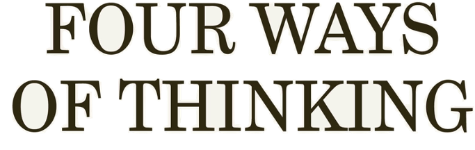
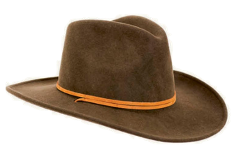

This is the companion website to David Sumpter's book 
`Four Ways of Thinking <https://www.penguin.co.uk/books/321012/four-ways-of-thinking-by-sumpter-david/9780241604069>`_.
These pages allow you to get deeper in to the mathematics presented 
in the book. They are both a tour of things that were a 
bit too involved to get in to the book and can be read as standalone mini-adventures in to mathematics.
They also contain reference material for those looking to learn more. 
I have tried to make each section in a way that allows you to spend a time really getting in to a subject.

You should be able to follow along using the maths you learnt in high school, but
some programming experience can help. Each section gives links to useful background, 
often using `BBC Byte Size <https://www.bbc.co.uk/bitesize/subjects/zqhs34j>`_ and/or 
`Khan Academy <https://www.khanacademy.org/math/statistics-probability>`_, which 
provide good summaries of methods. Although many of the topics --- :ref:`maximum likelihood<alikelyanswer>`, :ref:`chaos<chaosbutterfly>` 
entropy etc. --- are taught in university maths and statsitics courses, 
often in the second or third years, my aim is to show step-by-step how they work without 
advanced mathematical background. I hope this approach can be particularly useful to
students (upper secondary school or early university... or maybe those thinking about 
studying at univesity...), teachers (looking for examples to illustrate why maths is useful) and professionals 
(interested in a new way of seeing maths and who want to understand a new approach),
and to people who work with statistics and computing in their jobs and want to get to the bottom
of the underlying mathematical ideas.

Many of the examples include code in Python. I recommend you download 
`Anaconda <https://www.anaconda.com/products/distribution>`_ and run the code in either 
a `Python
Notebook <https://colab.research.google.com>`_ (download .ipynb files) or 
using `Spyder <https://www.spyder-ide.org>`_ (download .py files). 
Personally, I learn mathematics best when I have example applications, 
code to run which solves numerical examples, 
a graphical understanding, along with the maths itself. 
It is all of these which I aim to provide here.  

Contents
========

.. toctree::
   :maxdepth: 1
   :caption: Statistical

   lesson1/averagefriends.rst
   lesson1/alikelyanswer.md
   gallery/lesson1/plot_howtobehappy
   gallery/lesson1/plot_happyperson

.. toctree::
   :maxdepth: 1
   :caption: Interactive

   gallery/lesson2/plot_rabbitsandfoxes
   gallery/lesson2/plot_socialepidemic
   gallery/lesson2/plot_morethanthesum
   gallery/lesson2/plot_cellularautomata
   gallery/lesson2/plot_theartofagoodargument

.. toctree::
   :maxdepth: 1
   :caption: Chaotic

   gallery/lesson3/plot_elfarol
   gallery/lesson3/plot_thebutterflyeffect
   gallery/lesson3/plot_cellularchaos
   gallery/lesson3/plot_informationequalsrandomness

.. toctree::
   :maxdepth: 1
   :caption: Complex

   gallery/lesson4/plot_I_II_III_IV
   gallery/lesson4/plot_all_of_the_life
   gallery/lesson4/plot_labyrinthfactory
   gallery/lesson4/plot_langtonsloop
   lesson4/fractals.rst
   gallery/lesson4/plot_hardedges

