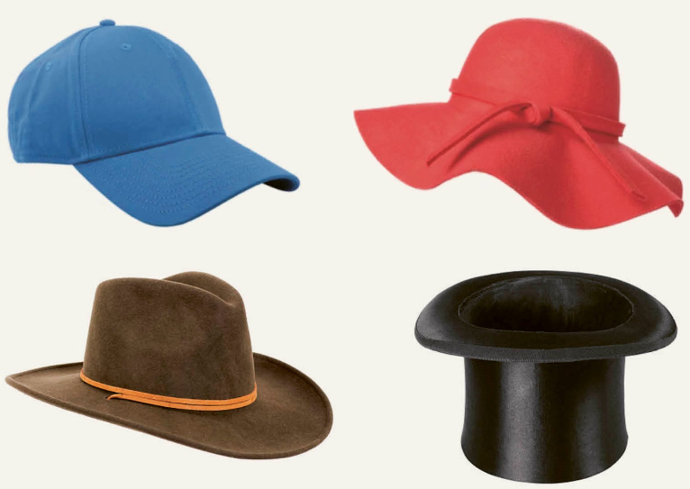

**Four Ways of Thinking**

-------
Welcome
-------

This is the companion website to David Sumpter's book 
`Four Ways of Thinking <https://www.penguin.co.uk/books/321012/four-ways-of-thinking-by-sumpter-david/9780241604069>`_.

The purpose of these pages is to allow those who want to, 
to get deeper in to the mathematics discussed 
in the book. Many of the topics --- maximum likelihood, :ref:`chaos<chaosbutterfly>` 
entropy etc. --- are usually taught in university maths and statsitics courses, 
often in the second or third years. They are advanced topics. In these pages, 
I show step-by-step how they work, starting from high school mathematics. 

These pages shouldn't be taken as a textbook on the various subjects covered. Instead, 
they are things I personally find interesting about the mathematics behind the book. 
I want to provide an approach which can be useful to
students (upper secondary school or early university... or maybe those thinking about what you would study at
univesity...), teachers (looking for examples to illustrate why maths is useful) and professionals 
(interested in a new way of seeing maths and who want to understand a new approach). 
Each section gives links to useful background, mainly to BBC Byte Size and to Khan Academy, which I 
find provide good summaries of methods.

Many of the examples include code in Python. I recommend you download 
`Anaconda <https://www.anaconda.com/products/distribution>`_ and run the code in either 
a `Google Colab
Notebook <https://colab.research.google.com>`_ (download .ipynb files) or 
using `Spyder <https://www.spyder-ide.org>`_ (download .py files). 
Personally, I learn mathematics best when I have example applications, 
code to run which solves numerical examples, 
a graphical understanding, along with the maths itself. 
It is all of these which I aim to provide here.  

*Enjoy!*

Contents
========

.. toctree::
   :maxdepth: 1
   :caption: Class I:

   lesson1/averagefriends.md
   lesson1/alikelyanswer.md
   gallery/lesson1/plot_howtobehappy
   gallery/lesson1/plot_happyperson

.. toctree::
   :maxdepth: 1
   :caption: Class II:

   gallery/lesson2/plot_rabbitsandfoxes
   gallery/lesson2/plot_socialepidemic
   gallery/lesson2/plot_morethanthesum
   gallery/lesson2/plot_cellularautomata
   gallery/lesson2/plot_theartofagoodargument

.. toctree::
   :maxdepth: 1
   :caption: Class III:

   gallery/lesson3/plot_thebutterflyeffect
   gallery/lesson3/plot_cellularchaos
   gallery/lesson3/plot_informationequalsrandomness

.. toctree::
   :maxdepth: 1
   :caption: Class IV:

   gallery/lesson4/plot_I_II_III_IV
   gallery/lesson4/plot_all_of_the_life

.. toctree::
   :maxdepth: 1
   :caption: Solutions:

   solutionsI.rst
