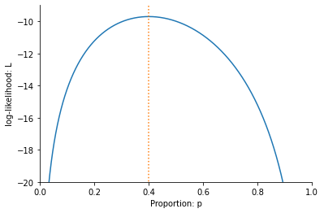

A likely answer
---------------

**What we will learn:** Understanding probabilities and likelihoods. Why we measure proportions the way we do. Logarithms and log-likelihoods. Find the maximum (log-)likelihood estimate and prove it is indeed maximum. Understand some of the thought process behind Fisher' original paper [On an Absolute Criterion for Fitting Frequency Curves](https://www.jstor.org/stable/pdf/2246266.pdf?refreqid=excelsior%3Ace877822879bb8e9c1500ec9d6c0d244&ab_segments=&origin=&acceptTC=1).

**Pre-requisits:** High school knowledge of [Basic probability](https://www.khanacademy.org/math/cc-seventh-grade-math/cc-7th-probability-statistics#cc-7th-basic-prob) and [Logarithms](https://www.bbc.co.uk/bitesize/guides/zn3ty9q/revision/1) will get you through the first half of this description. Later on we use [the product rule for derivatives](https://www.khanacademy.org/math/differential-calculus/dc-diff-intro#dc-product-rule) and
[derivatives of logarithms](https://www.khanacademy.org/math/in-in-grade-12-ncert/xd340c21e718214c5:continuity-differentiability/xd340c21e718214c5:logarithmic-functions-differentiation/v/logarithmic-functions-differentiation-intro). Finally, fo more advanced students, in the final section we use [undergraduate probability and statistics](https://www.probabilitycourse.com).

### The data

In the previous lesson we looked at the ‘Yes’ and ‘No’ answers to the gherkin question as $1$ for ‘Yes’ and $0$ for ‘No’. This gave us a table with a 1 if a person likes gherkins, a 0 if they don’t.
 

Anthony | Aisha |Charlie | Becky| Jennifer| Richard| Nia	|John | Sofie	| Suki
--- |--- |--- | --- |--- |--- |--- | --- |--- |--- 
1|	0|	1 |	0	| 1|	0| 0	|1	|0	| 0|

Intuitively, it feels like the best estimate, from this data, of the frequency of Millennial Londoners who like pickled gherkins is 4/10 or 40%.  If we take the average of all the 1’s’ and 0’s in the table above, we get exactly this answer:

$$ \frac{1+0+1+0+1+0+0+1+0+0}{10}=\frac{4}{10}$$

How do we know this is the correct answer? Imagine, for instance, that some of the friends objected to using the average using some, admittedly, quite dubious arguments. Antony might claim we should give extra weighting to the answers of those you asked first because ‘they are the originals’. He adds up $2 + 0 + 2 + 2 + 0 = 6$ for the first five and $0 + 0 + 1 + 0 + 0 = 1$ for the last five, and estimates the proportion be $(6+ 1)/15 = 7/15$. 

On hearing Antony’s argument, Aisha counter claims that it’s better to ask 5 people and ignore all the others. She just looks at the answer of every second person and finds that, out of this group, only one person (John, as it turns out) likes pickled gherkins and concludes that the proper proportion is $1/5$. Finally, Charlie says, ‘Hey guys. Let’s just listen to the first person and accept what he says is true. It will save us from arguments later on.’ 

Charlie proclaims that ‘Antony loves pickled gherkins, so everyone loves pickled gherkins!’

How do we convince Antony, Aisha and Charlie that they are all wrong and that there is only one correct way of measuring the proportion who like pickled gherkins and it is 40%? 

### Enter Ronald Fisher

In *Four Ways* I take you back in time to visit Ronald Fisher and look how he would have answered the question.

Fisher made the argument as follows. Imagine for now that we don’t know the exact proportion of people that will answer ‘yes’ to the Gherkin question– but we can be sure it has some value between zero and 100%. He would then ask Antony (who suggested $7/15$), Aisha (who proposed $1/5$), Charlie (who thinks 100% of people like gherkins) to calculate the likelihood of their suggestions given the data on gherkin preferences.

Let’s start with Aisha’s suggestion that the probability that a person likes a gherkin is $1/5$ or 20%. If she is correct then the likelihood that we got the answer we got from Charlie is $1/5$, since he said he liked gherkins. Similarly, again assuming, as Antony does, that 80% of people don’t like gherkins, then the likelihood of Sue’s answer is $4/5$. We can now write out a table of the likelihood of each person’s answer, as follows,

Anthony | Aisha |Charlie | Becky| Jennifer| Richard| Nia	|John | Sofie	| Suki
--- |--- |--- | --- |--- |--- |--- | --- |--- |--- 
1/5|	4/5|	1/5 |	4/5	| 1/5|	4/5| 4/5	|1/5	|4/5	| 4/5|

The combined likelihood of all the answers is found by multiplying the likelihoods of all the answers together,  i.e. 

$$
1/5 \cdot 4/5 \cdot 1/5 \cdot 4/5 \cdot 1/5 \cdot 4/5 \cdot 4/5 \cdot 1/5 \cdot 4/5 \cdot 4/5=0.000419
$$

where we use a dot ($\cdot$) to represent multiplication. 

Clearly, the probability of this particular sequence of answers is very small, because it is the probability of us getting a very specific sequence of answers. This does not in itself prove that Aisha is wrong: the probability of any sequence of answers is necessarily going to be quite small. Instead, what is useful about this calculation is that it allows us to compare the likelihood of Aisha’s proposal to the other proposals.

To see how, let’s start by comparing the likelihood of Aisha’s estimate to that of Charlie, who claimed that 100% of people liked gherkins. This gives a likelihood of

$$
1 \cdot 0 \cdot 1 \cdot 0 \cdot 0 \cdot 0 \cdot 0 \cdot 1 \cdot 0 \cdot 0=0
$$

There is literally zero likelihood of getting the answers we did given his suggestion. He is proven wrong as soon as Aisha gives her answer. So, Aisha wins that one. For Antony, we get,

$$
7/15 \cdot 8/15 \cdot 7/15 \cdot 8/15 \cdot 7/15 \cdot 8/15 \cdot 8/15 \cdot 7/15 \cdot 8/15 \cdot 8/15=0.00109
$$

Antony is less wrong than Aisha, because 0.00109 is larger than 0.000419. But neither of them are as good as the correct estimate, of 4/10, for which we get a likelihood

$$
4/10 \cdot 6/10 \cdot 4/10 \cdot 6/10 \cdot 4/10 \cdot 6/10 \cdot 6/10 \cdot 4/10 \cdot 6/10 \cdot 6/10=0.00119
$$

We have a winner! Our value of 40% has the largest likelihood out of those we tested. 

### Likelihood function

In the above example we compare tried out different proportions and calculated their likelihood. Let's now the same exercise, but use the letter $p$ to denate the probability that a person likes
gerkhins, and the letter $l$ to denate the likelihood of the answers. For these particular answers,

$$
l = p \cdot (1-p) \cdot p \cdot (1-p) \cdot p \cdot (1-p) \cdot (1-p) \cdot p \cdot (1-p) \cdot (1-p)
$$ 

where $(1-p)$ is the probability that a person doesn't like gherkins. 

We can rewrite this equation using exponents, which are used to denote multiplying numbers together. For example, if we multiply three twos together ($2\cdot 2\cdot 2=8$), a short hand is to write $2^3$. So, $2^3=2\cdot 2\cdot 2=8$ and we say ‘$2$ to the power of $3$ is $8$’. The number $3$ is known as the *exponent*. Similarly, $2^6=2\cdot 2\cdot 2\cdot 2\cdot 2\cdot 2=64$. Now $6$ is the exponent. Multiplying numbers by themselves makes them very large, very quickly. For example, $2^20=1,048,576$ and $2^100=1,267,650,600,228,229,401,496,703,205,376$. The number of atoms in the Universe is (very) roughly equal to $2^266$.

Since it doesn't matter which order we muliply, we can now write,

$$
l= p^4 \cdot (1-p)^6
$$

The probability of the particular set of preferences expressed by these 10 people. When p=0.4 then this becomes 
l = (4/10)^4 \cdot (1-4/10)^6=(4^4 〖\cdot 6〗^6)/10^10 =11664/9765625≈0.00119
as we also saw above. 

One way of showing that this is the best value is to plot the likelihood for every possible value of $p$. This is done in the figure below:

This has a maximum at $0.4$. This is why the estimate $p=0.4$ is the best estimate. If we look at any other value on this plot, it is less likely than 0.4, which is the maximum.

### Logarithms and log-likelihood function

When dealing with independent events, such as dice throws or coin tosses or people liking gherkins, we multiply the probabilities of each event in order to find the probability of them occurring. Just like repeatedly multiplying by a number greater than 1 (such 2) makes them large very quickly, multiplying probabilities makes them small very quickly. For example, the probability of getting 10 sixes in a row is $(1/6)^{10}$, which is less than one in in 60 million. The fact that multiplying makes numbers small (or large) very fast is one of the reasons for using logarithms, which I will now introduce.

Logarithms are the opposite of powers. If we ask ‘what is $\log_2(8)$?’ then we are asking how many times I need to multiply $1$ by $2$ in order to get 8. The answer is that $\log_2(8)$=3, since as we just saw, I need to multiply three times to get 8 (i.e. $2^3=2\cdot 2\cdot 2=8$). Similarly, $\log_2(64)=6$, since $2$ multiplied $6$ times is $64$.  The logarithm of $8$ and $64$ can be thus thought of as undoing the power of $2$ to give us $3$ and $6$, respectively. 

The value $2$ written in the subscript in $\log_2$ is know as the base of the logarithm. We can have other bases. So for example, if I ask ‘what is $\log_10(10000)$?’ then I am asking how many times I need to multiply $1$ by $10$ in order to get $10,000$. The answer is \log_10(10000)=4.

Logarithms turn multiplication in to addition. For powers, $2^3 \cdot 2^3= 2 \cdot 2 \cdot 2 \cdot 2 \cdot 2 \cdot 2 = 2^6$. We add the exponents when we multiply. For logarithms, 

$$
\log_2(64) = \log_2(2 \cdot 2 \cdot 2 \cdot 2 \cdot 2 \cdot 2) = \log_2(2^6) = 6 \cdot \log_2(2)=6
$$

It is these properties we now use for likelihoods, using the letter $p$ instead of numbers. For example,

$$
\log_2(p^4) = 4 \log_2(p)
$$

So when we have,

$$
l= p^4 \cdot (1-p)^6
$$

we can take the logarithm to get 

$$
L = \log_2 \left(p^4 \cdot (1-p)^6\right) = \log_2\left(p^4\right) + \log_2\left((1-p)^6\right) = 4 \log_2(p) + 6\log_2\left(1-p\right) 
$$
This is known as the *log-likelihood*. We can calulate the log-likelihood for each value of $p$ and plot $l$ as a function of $p$, as follows:

Notice that it also has its maximum value at $p=0.4$, the value we said was the maximum likelihood estimate of the proportion of people who like gerkhins. If we find the value of $p$ which maximises the log-likelihood, we also find the value that maximises the likelihood. 

### The Maximum Likelihood

Let's now prove that $p=0.4$ is the maximum likelihood. Up to now we have plotted the likelihood and log-likelihood, but we haven't demonstrated algebraically that the maximum must be $p=0.4$. To do this we use differentiation. The derivative of a function tells its slope at various points. For example, the function

$$
f(p) = p(1-p) 
$$

has derivative

$$
\frac{df}{dp} = 1 - 2p
$$

We can find the maximum by solving 

$$
\frac{df}{dp} = 1 - 2p = 0 
$$

which gives $p=1/2$. One reason we know that $p=1/2$ is a maximum (minimums of functions also have slope zero) is that the derivative $\frac{dl}{dp}$ is positive when $p<1/2$ and negative when $p>1/2$.

We can also take derivatives of functions containing logarithms. For example, for the function

$$
F = \log_2(p) + \log_2(1-p) 
$$

the derivative is ([derivatives of logarithms are described here](https://www.khanacademy.org/math/ap-calculus-ab/ab-differentiation-2-new/ab-3-1b/v/logarithmic-functions-differentiation-intro))

$$
\frac{dF}{dp} = \log_{\mbox{e}}(2) \left( \frac{1}{p} - \frac{1}{1-p} \right)
$$

Again, this is zero when $p=1/2$, corresponding to the maximum.

We can now differentiate the likelihood function 

$$
l(p) = p^4 \cdot (1-p)^6
$$

Using the [product rule for derivatives](https://www.khanacademy.org/math/differential-calculus/dc-diff-intro#dc-product-rule) we get

$$
\frac{dl}{dp} = -2p^3 (5p-2)(1-p)^5
$$

Notice that derivatives has three solutions when set equal to zero: $p=0$, $p=1$ and $p=2/5$. We know that the likelihoods at $p=0$ and $p=1$ are zero and thus minimima, so $p=2/5$ (i.e.$p=0.4$) is a maximum. 

We get a similar result for the log-likelihood function

$$
L = 4 \log_2(p) + 6\log_2\left((1-p)\right) 
$$

the derivative is

$$
\frac{dL}{dp} = \log_{\mbox{e}}(2) \left( \frac{4}{p} - \frac{6}{1-p} \right)
$$

This is zero when

$$
4(1-p) - 6p = 0 
$$

which, once again, occurs when $p=4/10$. 

We have thus shown, both using the likelihood and the log-likelihood, that the most likely estimate
of the probability someone likes gherkins is $p=4/10$. 

### Fisher's original paper

Most people would accept that 0.4 as the correct answer to the gherkin problem, even without the detailed maths I have done here. The point of my presentation, though, is to introduce the way Fisher thought about the problem of estimation using a problem we all understand. In 1912, Fisher was trying to introduce a mathematical framework for evaluating different ways of measuring in more complex situations as well. Now that we have gone through the simpler problem, we can look at the article he wrote over a hundred years ago.

Let's start with the abstract:

The problem Fisher is concerned with is the best way to fit a curve to data. In our example above, we are estimating a single point (the proportion of people who like gerkihns), but we might also be interested in fitting a straight line through data points (as we do in the chapter 'Happy world') or maybe a quadratic curve to describe, for example, the motion of a projectile. 

Fisher rightly points out that there are "different standards of conformity" between theory and data. He wants to know which one is right. Or maybe it is more correct to say, that what he wants to find out is the nature of the assumptions we make when we choose a particular way of comparing a theoretical curve to data. 

It is to this end he introduces the notion he will later call maximum likelihood. He writes,

Now, there are more mathematical symbols here than in our example. To see the relationship look at the second of the two equations, which I have rewritten slightly more explicit notation,

$$
\log(P) = \sum^{n}_{i=1} log(f(x_i))
$$

Here $i$ is an index over all $n$ obsevrvations and $f(x_i)$ is the probability we see observation $x_i$. In our gherkin example, $x_i$ is zero when the person does not like the gherkin and one when the person does like it. So,

$x_1$ | $x_2$ |$x_3$ | $x_4$| $x_5$| $x_6$| $x_7$ |$x_8$ | $x_9$ | $x_{10}$
--- |--- |--- | --- |--- |--- |--- | --- |--- |--- 
1|	0|	1 |	0	| 1|	0| 0	|1	|0	| 0|

Fisher insists that we define a function $f(x)$ which tells us the probability we get a specific observation. In our case, we define the function to be $f(0) = 1 - p$ and $f(1) = p$, where $p$ is the parameter we want to estimate. Substituting, $1-p$ in to equation above whenever $x_i=0$ and $p$ whenever $x_i=1$ gives

$$
\log(P) = 4 log(p) + 6 log(1-p)
$$

which is exactly the log-likelihood, which we called $L$ and which we saw above is maximised when $p=0.4$.

Fisher calls the parameter $\theta$ instead of $p$. So we could write $f(0) = 1 - \theta$ and $f(1) = \theta$ instead, if we followed his notation. There is also a more subtle difference in notation by Fisher, where he writes that the probability we see an observation is $p = f(x) dx$, rather than $f$ as I write above. This is to allow us to model outcomes which have continuous variables. In probability thoery $f(x)$ is known as the [probability density function (pdf)](https://www.probabilitycourse.com/chapter4/4_1_1_pdf.php) and tells us probability per unit length (where $dx$ is unit length) as that length goes to zero.  Specifically,

$$
f(x) = \lim_{dx \rightarrow 0} \frac{P(x < X \leq x +dx)}{dx}
$$

It is the probability that a value lies between $x$ and $x +dx$ as $dx$ gets very small. 

The example of this which Fisher looks at the case wher the pdf as that of the [Normal distribution](https://www.probabilitycourse.com/chapter4/4_2_3_normal.php). He writes

Fisher thus shows that the Maximum Likelihood Estimate of the mean, $m$, and variance, $s^2$ of the distribution are 

$$
m = \frac{1}{n} \sum^{n}_{i=1} x_i \mbox{ and } s^2 = \frac{1}{n} \sum^{n}_{i=1} (x_i-m)^2
$$

(note that the variance is equal to $s^2=1/(2h^2)$ in Fisher's notation). Fisher goes on to argue that the way that many other statisticians estimate the variance, using

$$
s^2 = \frac{1}{n-1} \sum^{n}_{i=1} (x_i-m)^2
$$

is wrong. In fact, statisticians now agree that it was Fisher who was wrong and the $n-1$ method, [which is  unbiased](https://www.probabilitycourse.com/chapter8/8_2_2_point_estimators_for_mean_and_var.php), is most often used today. Fisher quietly [changed his mind too](https://projecteuclid.org/journals/statistical-science/volume-12/issue-3/RA-Fisher-and-the-making-of-maximum-likelihood-1912-1922/10.1214/ss/1030037906.pdf) (although was loathe to explicitly admit it in writing).

What I do want to leave with you with is what I think is so fantastic about the way Fisher worked as a student in 1912. For me, the paper seems to come from a deep disatisfaction with just being told 'this is how you measure things'. He wanted to know why and, as a result, he found a way of thinking about how lkely a particular set of data was. Instead of just fitting a curve to data by measuring the distance between points and the curve, he asked what is the probability I would get this data, given my assumptions about the curve. 

