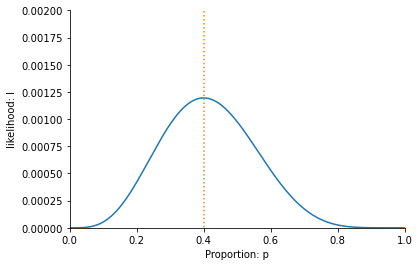
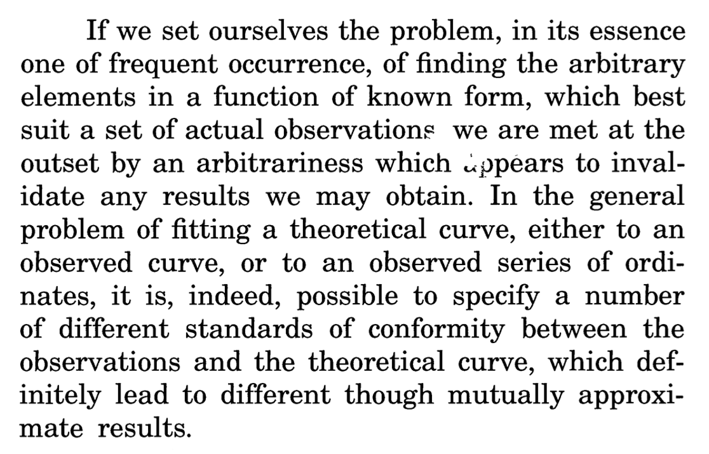
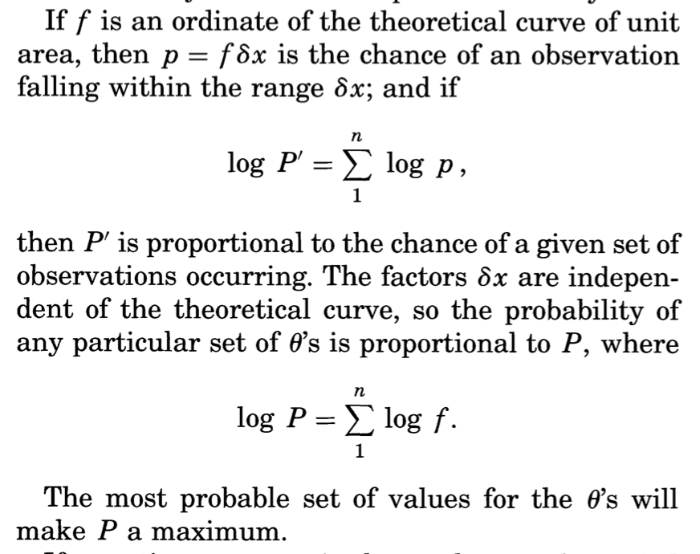
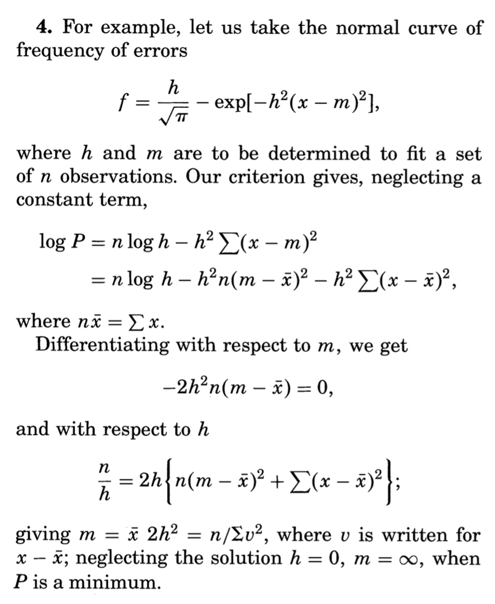

.. role:: raw-latex(raw)
   :format: latex
..

.. _alikelyanswer:

A likely answer
===============

In Four Ways, we now move from nodern day London to Cambridge before th first world 
war to meet statistician Ronald Fisher. In this lesson, I go in to more details
about probabilities and likelihoods, and explain (using Fisher's maximum likelihood approach) 
why we measure proportions the way we do. The Understand some of the thought process behind Fisher’ original
paper `On an Absolute Criterion for Fitting Frequency
Curves <https://www.jstor.org/stable/pdf/2246266.pdf?refreqid=excelsior%3Ace877822879bb8e9c1500ec9d6c0d244&ab_segments=&origin=&acceptTC=1>`__.

To follow this lesson you will need high school knowledge of 
`probability <https://www.khanacademy.org/math/cc-seventh-grade-math/cc-7th-probability-statistics#cc-7th-basic-prob>`__.
Later sections will also use 
`logarithms <https://www.bbc.co.uk/bitesize/guides/zn3ty9q/revision/1>`__
and the 
`the product rule for
derivatives <https://www.khanacademy.org/math/differential-calculus/dc-diff-intro#dc-product-rule>`__
and `derivatives of
logarithms <https://www.khanacademy.org/math/in-in-grade-12-ncert/xd340c21e718214c5:continuity-differentiability/xd340c21e718214c5:logarithmic-functions-differentiation/v/logarithmic-functions-differentiation-intro>`__.
For those who would like a refresher on more advanced probability and statistics, I recommend 
`undergraduate probability and statistics <https://www.probabilitycourse.com>`__ resource.

The data
--------

In the :ref:`previous lesson<averagefriends>` we looked at the ‘Yes’ and ‘No’ answers to the
gherkin question as :math:`1` for ‘Yes’ and :math:`0` for ‘No’. This
gave us a table with a 1 if a person likes gherkins, a 0 if they don’t.

+---------+----------+----------+----------+----------+----------+------+------+----------+------+
| Antony  | Aisha    | Charlie  | Becky    | Jennifer | Richard  | Nia  | John | Sofie    | Suki |
+=========+==========+==========+==========+==========+==========+======+======+==========+======+
| 1       |     0    |     1    |     0    |    1     |     0    |   0  | 1    | 0        | 0    |
+---------+----------+----------+----------+----------+----------+------+------+----------+------+

Intuitively, it feels like the best estimate, from this data, of the
frequency of Millennial Londoners who like pickled gherkins is 4/10 or
40%. If we take the average of all the 1’s’ and 0’s in the table above,
we get exactly this answer:

.. math::  \frac{1+0+1+0+1+0+0+1+0+0}{10}=\frac{4}{10}

In the book, the friends discuss this estimate and give some (pretty wild)
alternatives.

How do we convince Antony, Aisha and Charlie that they are all wrong and
that there is only one correct way of measuring the proportion who like
pickled gherkins and it is 40%?

Enter Ronald Fisher
-------------------

In *Four Ways* I take you back in time to visit Ronald Fisher and look
how he would have answered the question.

Fisher made the argument as follows. Imagine for now that we don’t know
the exact proportion of people that will answer ‘yes’ to the Gherkin
question– but we can be sure it has some value between zero and 100%. He
then asks Antony (who suggested :math:`7/15`), Aisha (who proposed
:math:`1/5`), Charlie (who thinks 100% of people like gherkins) to
calculate the likelihood of their suggestions given the data on gherkin
preferences.

Let’s start with Aisha’s suggestion that the probability that a person
likes a gherkin is :math:`1/5` or 20%. If she is correct then the
likelihood that we got the answer we got from Charlie is :math:`1/5`,
since he said he liked gherkins. Similarly, again assuming, as Aisha
does, that 80% of people don’t like gherkins, then the likelihood of
her own answer is :math:`4/5`. We can write out a table of the
likelihood of each person’s answer, as follows,

+---------+----------+----------+----------+----------+----------+------+------+----------+------+
| Antony  | Aisha    | Charlie  | Becky    | Jennifer | Richard  | Nia  | John | Sofie    | Suki |
+=========+==========+==========+==========+==========+==========+======+======+==========+======+
| 1/5     |   4/5    |   1/5    |   4/5    |  1/5     |   4/5    |  4/5 | 1/5  | 4/5      | 4/5  |
+---------+----------+----------+----------+----------+----------+------+------+----------+------+

The combined likelihood of all the answers is found by multiplying the
likelihoods of all the answers together, i.e. 

.. math::

   1/5 \times 4/5 \times 1/5 \times 4/5 \times 1/5 \times 4/5 \times 4/5 \times 1/5 \times 4/5 \times 4/5=0.000419

where we use a dot (:math:`\times`) to represent multiplication.

Clearly, the probability of this particular sequence of answers is very
small, because it is the probability of us getting a very specific
sequence of answers. This does not in itself prove that Aisha is wrong:
the probability of any sequence of answers is necessarily going to be
quite small. Instead, what is useful about this calculation is that it
allows us to compare the likelihood of Aisha’s proposal to the other
proposals.

To see how, let’s start by comparing the likelihood of Aisha’s estimate
to that of Charlie, who claimed that 100% of people liked gherkins. This
gives a likelihood of

.. math::

   1 \times 0 \times 1 \times 0 \times 0 \times 0 \times 0 \times 1 \times 0 \times 0=0

There is literally zero likelihood of getting the answers we did given
his suggestion. He is proven wrong as soon as Aisha gives her answer.
So, Aisha wins that one. 

.. admonition:: Think yourself!
   
   For Antony estimate of :math:`7/15` use a calculator to check that this 
   gives a likelihood of 0.00109

Antony is less wrong than Aisha, because 0.00109 is larger than
0.000419. But neither of them are as good as the correct estimate, of
4/10, for which we get a likelihood

.. math::

   4/10 \times 6/10 \times 4/10 \times 6/10 \times 4/10 \times 6/10 \times 6/10 \times 4/10 \times 6/10 \times 6/10=0.00119

We have a winner! Our value of 40% has the largest likelihood out of
those we tested.

Likelihood function
-------------------

In the above example (and in the book) we compared different proportions by
calculating their likelihood. Let’s now the same exercise, but use the
letter :math:`p` to denate the probability that a person likes gerkhins,
and the letter :math:`l` to denate the likelihood of the answers. For
these particular answers,

.. math::

   l = p \times (1-p) \times p \times (1-p) \times p \times (1-p) \times (1-p) \times p \times (1-p) \times (1-p)

where :math:`(1-p)` is the probability that a person doesn’t like
gherkins. All I have done here is replace the number (which was :math:`7/15` for Antony) with the
letter :math:`p`. This substitution allows us to make calulations which apply to all 
estimates.

We can rewrite this equation using exponents, which are used to denote
multiplying numbers together. For example, if we multiply three twos
together (:math:`2\times 2\times 2=8`), a short hand is to write
:math:`2^3`. So, :math:`2^3=2\times 2\times 2=8` and we say ‘:math:`2` to
the power of :math:`3` is :math:`8`’. The number :math:`3` is known as
the *exponent*. Similarly,
:math:`2^6=2\times 2\times 2\times 2\times 2\times 2=64`. Now :math:`6` is
the exponent. In the example above

.. math::

 4/10 \times 6/10 \times 4/10 \times 6/10 \times 4/10 \times 6/10 \times 6/10 \times 4/10 \times 6/10 \times 6/10 
 
 This equals,
 
 (4/10)^4 \times  (6/10)^6

 because we multiply :math:`4/10` 4 times and :math:`6/10` 6 times 
 (it doesn’t matter which order we muliply in). 
 
 We can also write, a general expression,

.. math::

   l= p^4 \times (1-p)^6

which is the probability of the particular set of preferences expressed by these
10 people. 

One way of showing that this is the best value is to plot the likelihood
for every possible value of :math:`p`. This is done in the figure below:

This has a maximum at :math:`0.4`. This is why the estimate
:math:`p=0.4` is the best estimate. If we look at any other value on
this plot, it is less likely than 0.4, which is the maximum. It is this value 
which is the *maximum likelihood estimate* of :math:`p`.

.. admonition:: Think yourself!
   
   What would the function :math:`l` look like if, out of 12 people, 7 of them said
   they liked gerkhins?

Logarithms and log-likelihood function
--------------------------------------

When dealing with independent events, such as dice throws or coin tosses
or people liking gherkins, we multiply the probabilities of each event
in order to find the probability of them occurring. Repeatedly
multiplying by a number greater than 1 (such 2) produces a very large number
very quickly. For example, 

.. math::

2^{20}=1\,048\,576

and

.. math::

2^{100}=1\,267\,650\,600\,228\,229\,401\,496\,703\,205\,376`
 
(we will see more examples of this when we look at :ref:`exponential growth<socialepidemic>`).
Similarly, multiplying probabilities makes very small numbers. For
example, the probability of getting 10 sixes in a row is
:math:`(1/6)^{10}`, which is less than one in in 60 million. The fact
that multiplying makes numbers small (or large) is one of the
reasons for using logarithms.

Logarithms are the opposite of powers. If we ask ‘what is
:math:`\log_2(8)`?’ then we are asking how many times I need to multiply
:math:`1` by :math:`2` in order to get 8. The answer is that
:math:`\log_2(8)`\ =3, since as we just saw, I need to multiply three
times to get 8 (i.e. :math:`2^3=2\times 2\times 2=8`). Similarly,
:math:`\log_2(64)=6`, since :math:`2` multiplied :math:`6` times is
:math:`64`. The logarithm of :math:`8` and :math:`64` can be thus
thought of as undoing the power of :math:`2` to give us :math:`3` and
:math:`6`, respectively.

The value :math:`2` written in the subscript in :math:`\log_2` is know
as the base of the logarithm. We can have other bases. So for example,
if I ask "what is :math:`\log_{10}(10000)`?" then I am asking how many
times I need to multiply :math:`1` by :math:`10` in order to get
:math:`10\,000`. The answer is :math:`\log_{10}(10000)=4.

.. admonition:: Think yourself!
   
   What are :math:`\log_{2}(256) and :math:`\log_{3}(27)?

Logarithms turn multiplication in to addition. For powers,
:math:`2^3 \times 2^3= 2 \times 2 \times 2 \times 2 \times 2 \times 2 = 2^6`.
We add the exponents when we multiply. For logarithms,

.. math::

   \log_2(64) = \log_2(2 \times 2 \times 2 \times 2 \times 2 \times 2) = \log_2(2^6) = 6 \times \log_2(2)=6

It is these properties we now use for likelihoods, using the letter
:math:`p` instead of numbers. For example,

.. math::

   \log_2(p^4) = 4 \log_2(p)

So when we have,

.. math::

   l= p^4 \times (1-p)^6

we can take the logarithm to get

.. math::

   L = \log_2 \left(p^4 \times (1-p)^6\right) = \log_2\left(p^4\right) + \log_2\left((1-p)^6\right) = 4 \log_2(p) + 6\log_2\left(1-p\right) 

This is known as the *log-likelihood*. We can calulate the
log-likelihood for each value of :math:`p` and plot :math:`l` as a
function of :math:`p`, as follows:

.. image:: ../images/lesson1/loglikelihood.png

Notice that it also has its maximum value at :math:`p=0.4`, the value we
said was the maximum likelihood estimate of the proportion of people who
like gerkhins. If we find the value of :math:`p` which maximises the
log-likelihood, we also find the value that maximises the likelihood.

The Maximum Likelihood
----------------------

Let’s now prove that :math:`p=0.4` is the maximum likelihood. Up to now
we have plotted the likelihood and log-likelihood, but we haven’t
demonstrated algebraically that the maximum must be :math:`p=0.4`. To do
this we use differentiation. The derivative of a function tells its
slope at various points. For example, the function

.. math::

   f(p) = p(1-p) 

has derivative

.. math::

   \frac{df}{dp} = 1 - 2p

We can find the maximum by solving

.. math::

   \frac{df}{dp} = 1 - 2p = 0 

which gives :math:`p=1/2`. One reason we know that :math:`p=1/2` is a
maximum (minimums of functions also have slope zero) is that the
derivative :math:`\frac{dl}{dp}` is positive when :math:`p<1/2` and
negative when :math:`p>1/2`. This means the function climbs upwards (positive slope)
to :math:`p=1/2` then decsends downwards (negative slope).

We can also take derivatives of functions containing logarithms. For
example, for the function

.. math::

   F = \log_2(p) + \log_2(1-p) 

the derivative is (`derivatives of logarithms are described
here <https://www.khanacademy.org/math/ap-calculus-ab/ab-differentiation-2-new/ab-3-1b/v/logarithmic-functions-differentiation-intro>`__)

.. math::

   \frac{dF}{dp} = \log_{\mbox{e}}(2) \left( \frac{1}{p} - \frac{1}{1-p} \right)

Again, this is zero when :math:`p=1/2`, corresponding to the maximum.

We can now differentiate the likelihood function

.. math::

   l(p) = p^4 \times (1-p)^6

Using the `product rule for
derivatives <https://www.khanacademy.org/math/differential-calculus/dc-diff-intro#dc-product-rule>`__
we get

.. math::

   \frac{dl}{dp} = -2p^3 (5p-2)(1-p)^5

Notice that derivatives has three solutions when set equal to zero:
:math:`p=0`, :math:`p=1` and :math:`p=2/5`. We know that the likelihoods
at :math:`p=0` and :math:`p=1` are zero and thus minimima, so
:math:`p=2/5` (i.e. :math:`p=0.4`) is a maximum.

We get a similar result for the log-likelihood function

.. math::

   L = 4 \log_2(p) + 6\log_2\left((1-p)\right) 

the derivative is

.. math::

   \frac{dL}{dp} = \log_{\mbox{e}}(2) \left( \frac{4}{p} - \frac{6}{1-p} \right)

This is zero when

.. math::

   4(1-p) - 6p = 0 

which, once again, occurs when :math:`p=4/10`.

We have thus shown, both using the likelihood and the log-likelihood,
that the most likely estimate of the probability someone likes gherkins
is :math:`p=4/10`.

Fisher’s original paper
-----------------------

Most people would accept that 0.4 as the correct answer to the gherkin
problem, even without the detailed maths I have done here. The point of
my presentation, though, is to introduce the way Fisher thought about
the problem of estimation using a problem we all understand. In 1912,
Fisher was trying to introduce a mathematical framework for evaluating
different ways of measuring in more complex situations as well. Now that
we have gone through the simpler problem, we can look at the article he
wrote over a hundred years ago.

Let’s start with the abstract:

The problem Fisher is concerned with is the best way to fit a curve to
data. In our example above, we are estimating a single point (the
proportion of people who like gerkihns), but we might also be interested
in fitting a straight line through data points (as in the :ref:`Happy World<averagefriends>`
chapter of the book) or maybe a quadratic curve to describe, for example, the
motion of a projectile.

Fisher rightly points out that there are “different standards of
conformity” between theory and data. He wants to know which one is
right. Or maybe it is more correct to say, that what he wants to find
out is the nature of the assumptions we make when we choose a particular
way of comparing a theoretical curve to data.

It is to this end he introduces the notion he will later call maximum
likelihood. He writes,

Now, there are more mathematical symbols here than in our example. To
see the relationship look at the second of the two equations, which I
have rewritten slightly more explicit notation,

.. math::

   \log(P) = \sum^{n}_{i=1} log(f(x_i))

Here :math:`i` is an index over all :math:`n` obsevrvations and
:math:`f(x_i)` is the probability we see observation :math:`x_i`. In our
gherkin example, :math:`x_i` is zero when the person does not like the
gherkin and one when the person does like it. 

Fisher insists that we define a function :math:`f(x)` which tells us the
probability we get a specific observation. In our case, we define the
function to be :math:`f(0) = 1 - p` and :math:`f(1) = p`, where
:math:`p` is the parameter we want to estimate. Substituting,
:math:`1-p` in to equation above whenever :math:`x_i=0` and :math:`p`
whenever :math:`x_i=1` gives

.. math::

   \log(P) = 4 log(p) + 6 log(1-p)

which is exactly the log-likelihood, which we called :math:`L` and which
we saw above is maximised when :math:`p=0.4`.

Fisher calls the parameter :math:`\theta` instead of :math:`p`. So we
could write :math:`f(0) = 1 - \theta` and :math:`f(1) = \theta` instead,
if we followed his notation. There is also a more subtle difference in
notation by Fisher, where he writes that the probability we see an
observation is :math:`p = f(x) dx`, rather than :math:`f` as I write
above. This is to allow us to model outcomes which have continuous
variables. In probability thoery :math:`f(x)` is known as the
`probability density function
(pdf) <https://www.probabilitycourse.com/chapter4/4_1_1_pdf.php>`__ and
tells us probability per unit length (where :math:`dx` is unit length)
as that length goes to zero. Specifically,

.. math::

   f(x) = \lim_{dx \rightarrow 0} \frac{P(x < X \leq x +dx)}{dx}

It is the probability that a value lies between :math:`x` and
:math:`x +dx` as :math:`dx` gets very small.

The example of this which Fisher looks at the case wher the pdf as that
of the `Normal
distribution <https://www.probabilitycourse.com/chapter4/4_2_3_normal.php>`__.
He writes

Fisher thus shows that the Maximum Likelihood Estimate of the mean,
:math:`m`, and variance, :math:`s^2` of the distribution are

.. math::

   m = \frac{1}{n} \sum^{n}_{i=1} x_i \mbox{ and } s^2 = \frac{1}{n} \sum^{n}_{i=1} (x_i-m)^2

(note that the variance is equal to :math:`s^2=1/(2h^2)` in Fisher’s
notation). Fisher goes on to argue that the way that many other
statisticians estimate the variance, using

.. math::

   s^2 = \frac{1}{n-1} \sum^{n}_{i=1} (x_i-m)^2

is wrong. On this point, however, statisticians now (usually) 
agree that it was Fisher who is wrong and that the :math:`n-1` method, `which is
unbiased <https://www.probabilitycourse.com/chapter8/8_2_2_point_estimators_for_mean_and_var.php>`__,
is better. Fisher quietly `changed his mind
too <https://projecteuclid.org/journals/statistical-science/volume-12/issue-3/RA-Fisher-and-the-making-of-maximum-likelihood-1912-1922/10.1214/ss/1030037906.pdf>`__
(although was loathe to explicitly admit it in writing). 

Fisher's biggest contribution in this article and, even more so, in his later work was 
to introduce a framework for discussing and comparing statistical methods.
This is what I think is so fantastic about the way Fisher worked as a student in 1912. 
For me, the paper seems to come from a deep disatisfaction with just being told ‘this is
how you measure things’. He wanted to know why and, as a result, he
found a way of thinking about how likely a particular set of data was.
Instead of just fitting a curve to data by measuring the distance
between points and the curve, he asked what is the probability I would
get this data, given my assumptions about the curve.

In Four Ways I look at another, darker side of Fisher, but on these webpages, 
this is where we now leave this part of our story.

