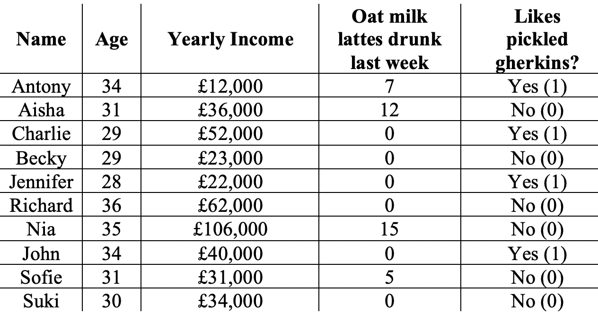
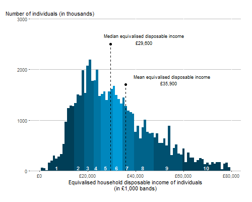

Very average friends
--------------------

**What we will learn:** How to calculate the mean, the median and proportions; when to use the mean or the median; mathematical notation for sums, means and proportions.

**Pre-requisits:** [KS2 maths](//www.bbc.co.uk/bitesize/topics/zm49q6f)

Throughout *Four Ways of Thinking* we follow the lives of ten friends living in London. We start with some basic statistics about their lives.

 

The numbers in this table tell us not only about the individuals, but also about the group as a whole. 

### The mean

The average or *mean* age of the friends is found by first adding up all the ages and then dividing by the number of people. That is,

$$\frac{34+31+29+29+28+36+35+34+31+30}{10}=31.7$$

<b>Challenge I:1</b>

**Calculate the mean value for yearly income.**

A pretty big hint is that: 

$$ 12+22+23+31+34+36+40+52+62+106 = 418 $$

Let's learn some mathematical the notation for the mean. When we want to use a mathematical concept, it is useful to replace numbers by symbols. For example, we can write $x_1=34$ as the age of the first person (Anthony), $x_2=31$ is the age of the second person (Aisha) and so on, all the way up to $x_n=30$, which is Suki's age. The mean is then written as follows,

$$ \bar{x} = \frac{x_1+x_2\ {+\ x}_3+\ldots+x_{n-1}+x_n}{n}$$

We sum the prices and then by dividing this sum by $n$ we get the mean. 

 A shorthand for writing a sum is using the Greek symbol Sigma, $\Sigma$, to denote the activity of summing up. For example, we write the mean as

$$\bar{x}=\frac{1}{n}\sum_{i=1}^{n}x_i$$

The $i$ here serves as an index: we count from $i=1$ up to $i=n$. So, the $i=1$ underneath the $\Sigma$ indicates we sum from $1$ up to the $n$. The $x_i$ are the things we sum up. The two expressions above – one where we write out the $x_1$ up to $x_n$, the other where we use $\Sigma$ shorthand – mean exactly the same thing. 

We won't use this mathematical notation now, but we will use it later when we look at Fisher's maximum likelihood.

### The median

When comparing incomes, it is common to use the median, rather than the mean. The median is calculated by first writing all the incomes in order as follows.

£12,000, £22,000, £23,000, £31,000, £34,000, £36,000, £40,000, £52,000, £62,000, £106,000

then noting that the middle two incomes are £34,000 and £36,000. Taking the average of these two gives a median of £35,000 per year. 

<b>Challenge I:2</b>

**What is the median age of the ten friends?**

Hint: The ages written in order from youngest to oldest as
28, 29, 29, 30, 31, 31, 34 , 34, 35 36 

### Proportions

The ‘Yes’ and ‘No’ answers to the gherkin question can be represented as $1$ for ‘Yes’ and $0$ for ‘No’. Let’s write their answers out again, with a 1 if a person likes gherkins, a 0 if they don’t.
 

Anthony | Aisha |Charlie | Becky| Jennifer| Hassan| Nia	|John | Sofie	| Suki
--- |--- |--- | --- |--- |--- |--- | --- |--- |--- 
1|	0|	1 |	0	| 1|	0| 0	|1	|0	| 0|

What is the best estimate, from this data, of the frequency of Millennial Londoners who like pickled gherkins?

Intuitively, it feels like the correct answer is 4/10 or 40%.  If we take the average of all the 1’s’ and 0’s in the table above, we get exactly this answer:

$$\bar{x} = \frac{1+0+1+0+1+0+0+1+0+0}{10}=\frac{4}{10}$$

Notice that the proportion is also a mean (an average). We sum the people who like gerkhins and then divide by the number of people.

<b>Challenge I:3</b>

**What proportion of the friends drunk soy lattes last week *and* like pickeled gherkins?**

### Using the mean and the median

There is no hard and fast rule about when to use the median and when to use the mean (when statisticians say the average, they mean the mean and they don’t mean the median). In the case of the friends’ ages, the mean makes most sense because the variation in ages is quite small. For incomes, the median makes more sense because Nia’s £106,000 per year skews the value of the average upwards. According to Forbes, London is home to 63 billionaires. If we include these super-rich in a mean income calculation, it becomes much larger than the median (often by 25 to 50% for incomes in big cities).

The plot below by the [UK Office for National Statistics](//https://www.ons.gov.uk/peoplepopulationandcommunity/personalandhouseholdfinances/incomeandwealth/bulletins/householddisposableincomeandinequality/financialyearending2019) shows the disposible income for UK citizens 

 

Even without including the super rich, the mean is larger than the median. 

The decision whether to use the mean or the median is thus a question of deciding what we want to highlight in the data. Using the median allows us to ignore the very rich and is, in this case, possibly a better measure of what is typical.

An extreme example of the difference between mean and median is seen when we look at soy lattes drunk. The median here is 0 (the majority don’t drink any), but the mean is 3.9. Both the mean and the median are needed to sum up our group of friends: it would be equally wrong to say that they don’t like lattes as to say they drink nearly a 4 a week! 

Whenever we make a measurement, like the mean or the median, we lose information about inidviduals. Histograms, like the one above, are often the best way for presenting data of the population as a whole.

### Well done

You have completed the first *Four Ways* lesson.

In the [next lesson](//https://educaora.com/@FourWays/A_likely_answer), we are going to show why the way we calculate the mean and proportions are the best way to do it, because they are maximum likelihood estimates.

