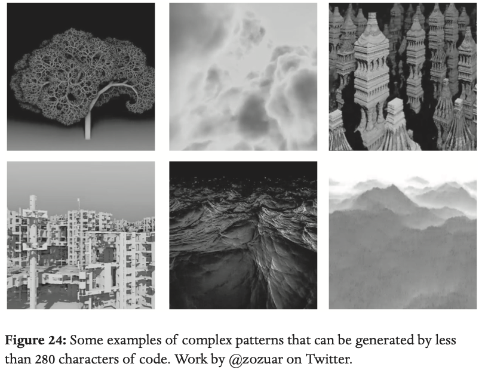

.. _fractals:

Dynamic fractals
================

An illustration of Kolmogorov's idea of capturing a complicated pattern in a 
short algorithm can be found in computer graphics. A subculture that has grown around
this idea involves creating tweet length (280 character) code for drawing complex patterns.

I show some of these in the book

from a Twitter account `@zozuar <https://twitter.com/zozuar>`__. 

Examples
--------

Here are some more of these in animated form. All of these are created with 280 characters
of computer code on a webpage called TWIGL. 

.. image:: ../images/lesson4/flower.gif

Flowers `(interactive version) <https://twigl.app/?ol=true&mode=7&source=for(float%20i,g,e,R,S%3Bi%2B%2B%3C1e2%3Bo.rgb%2B%3Dhsv(.4-.02/R,(e%3Dmax(e*R*1e4,.7)),.03/exp(e)))%7BS%3D1.%3Bvec3%20p%3Dvec3((FC.xy/r-.5)*g,g-.3)-i/2e5%3Bp.yz*%3Drotate2D(.3)%3Bfor(p%3Dvec3(log(R%3Dlength(p))-t,e%3Dasin(-p.z/R)-.1/R,atan(p.x,p.y)*3.)%3BS%3C1e2%3BS%2B%3DS)e%2B%3Dpow(abs(dot(sin(p.yxz*S),cos(p*S))),.2)/S%3Bg%2B%3De*R*.1%3B%7D>`__

.. image:: ../images/lesson4/water.gif

Water `(interactive version) <https://twigl.app/?ol=true&ss=-NPivuXkgj-je0DIXAPx>`__

.. image:: ../images/lesson4/landscape.gif

Landscape `(interactive version) <https://twigl.app/?ol=true&mode=7&source=for(float%20i,e,g,s%3Bi%2B%2B%3C1e2%3Bg%2B%3De*.4)%7Bvec3%20p%3Dvec3((FC.xy-.5*r)/r.y*g,g-5.)%3Bp.y-%3Dp.z*.6%3Bp.z%2B%3Dt%3Be%3Dp.y-tanh(abs(p.x%2Bsin(p.z)*.5))%3Bfor(s%3D2.%3Bs%3C1e3%3Bs%2B%3Ds)p.xz*%3Drotate2D(s),e%2B%3Dabs(dot(sin(p.xz*s),r/r/s/4.))%3Be%3Dmin(e,p.y)-1.3%3Bo%2B%3D.01-.01/exp(e*1e3-sign(p.y-1.31)*FC.zzwz*.1)%3B%7D>`__

.. image:: ../images/lesson4/parsley.gif

Parsley `(interactive version) <https://twigl.app/?ol=true&mode=7&source=for(float%20i,e,g,v,u%3Bi%2B%2B%3C80.%3B)%7Bvec3%20p%3Dvec3((.5*r-FC.xy)/r.y*g,g-4.)%3Bp.xz*%3Drotate2D(t*.2)%3Be%3Dv%3D2.%3Bfor(int%20j%3Bj%2B%2B%3C12%3Bj%3E3%3Fe%3Dmin(e,length(p.xz%2Blength(p)/u*.557)/v),p.xz%3Dabs(p.xz)-.7,p:p%3Dabs(p)-.9)v/%3Du%3Ddot(p,p),p/%3Du,p.y%3D1.7-p.y%3Bg%2B%3De%3Bo.rgb%2B%3D.01-hsv(-.4/u,.3,.02)/exp(e*60.)%3B%7D>`__

.. image:: ../images/lesson4/forest.gif

Forest `(interactive version) <https://twigl.app/?ol=true&mode=7&source=float%20l,i,e%3Bvec3%20q,p%3DFC.qpp%3Bfor(p.xz-%3Dt%3Bi%2B%2B%3C150.%3Bo%2B%3De/2e2)%7Bp.xz%3Dmod(p.xz%2B4.,8.)-4.%3Bq%3Dp%2B%3Dnormalize(FC.stp*2.-r.xyy)*e*.2%3Bfor(l%3De%3D1.%3Bl%3E.2%3Bl*%3D.8)q%3Dabs(q*1.2),e%3Dmin(e,max((q.y-%3D1.5)-.1,q.x%2Bq.z-l*.2)),q*%3Drotate3D(l,FC.qqp-.75)%3Be%3Dmin(e,p.y%2Bq.z*.1)%3B%7Do.gb-%3Dq.y/i*FC.pq%3B>`__

.. image:: ../images/lesson4/towers.gif

Towers `(interactive version) <https://twigl.app/?ol=true&mode=7&source=float%20i,s,e,m%3Bvec3%20d,w,q,p%3Bd%3DFC.rgb/r.y-1.%3Bfor(w%2B%3D4.%3Bi%2B%2B%3C2e2%3Be%3Dclamp(length(p)/s-m/s,w.y-m,.2)%2Bi/1e6)%7Bi%3E1e2%3Fd/%3Dd,o:o%2B%3Dexp(-e*5e3)%3Bs%3D2.%3Bp%3Dw%2B%3Dd*e%3Bp.xz*%3Drotate2D(t*.2)%3Bp-%3Dq%3Dround(p)%3Bp.y%3Dw.y-(m%3Dfsnoise(q.zx)*4.)%3Bfor(int%20j%3Bj%2B%2B%3C9%3Bp.y-%3Dm)s/%3De%3Dmin(dot(p,p),.4)%2B.1,p%3Dabs(p)/e-.2%3B%7Do*%3De/20.%3B>`__

Do it yourself
--------------

A good starting point if you want to learn to make these yourself is to try out
`Shadertoy <https://www.shadertoy.com>`__. Since the 280 character code challenge involves
getting as much as possible out of very short snippets of code, they can be difficult to follow.
So, I recommend you watch this video to start with.

 ..  youtube:: f4s1h2YETNY
   :width: 640
   :height: 349

Kishimisu goes step-by-step through the tools and the functions used to create striking 
dynamic visuals. 

The `flowers example <https://www.shadertoy.com/view/dtS3zG>`__ 
has also been implemented in shadertoy.

